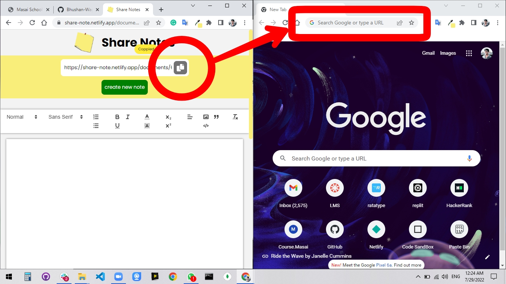
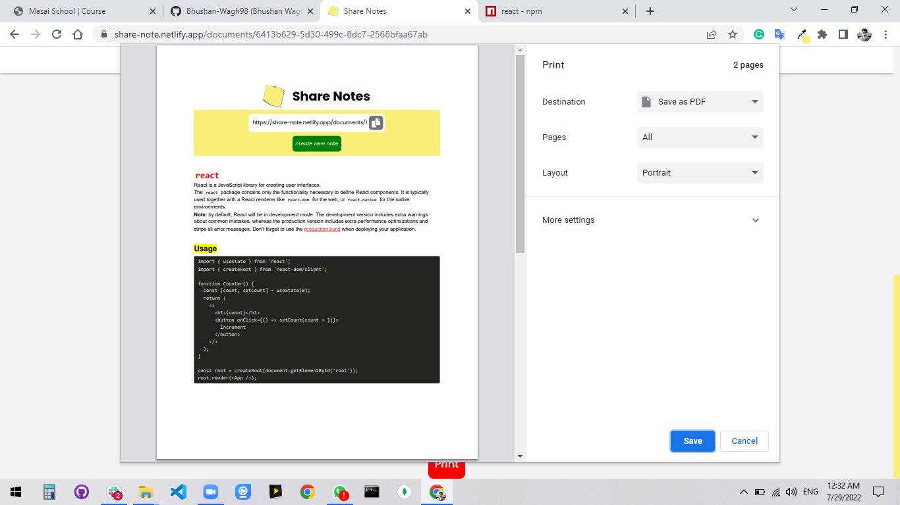

# Share Notes

A real-time collaborative notes application — create a note, share the link, and edit together with live updates across devices.

🔗 **Live App:** https://share-note.netlify.app/  
🔗 **Backend API:** https://share-notes-backend-a7fo.onrender.com/  
🔗 **Repository:** https://github.com/Bhushan-Wagh98/notes-app.git

## Features

- Real-time collaborative editing via Socket.io
- Rich text editor (Quill)
- Shareable note links
- User authentication with OTP-based email verification
- Admin dashboard for note management
- Print / export notes

## Tech Stack

| Layer    | Technologies                                      |
| -------- | ------------------------------------------------- |
| Frontend | React 19, TypeScript, Vite, Material UI, Quill    |
| Backend  | Express 5, TypeScript, Socket.io, Mongoose        |
| Database | MongoDB                                           |
| Auth     | JWT, bcryptjs, Nodemailer (OTP)                   |
| Deploy   | Netlify (frontend), Render (backend)              |

## Project Structure

```
├── frontend/       # React + Vite client
├── backend/        # Express + Socket.io server
└── screenshots/    # App screenshots
```

See individual READMEs for details:
- [Frontend README](./frontend/README.md)
- [Backend README](./backend/README.md)

## Getting Started

### Prerequisites

- Node.js v18+
- MongoDB instance (local or Atlas)

### Setup

1. **Clone the repo**
   ```bash
   git clone https://github.com/Bhushan-Wagh98/notes-app.git
   cd notes-app
   ```

2. **Backend**
   ```bash
   cd backend
   npm install
   # configure .env (see backend README)
   npm run dev
   ```

3. **Frontend**
   ```bash
   cd frontend
   npm install
   # configure .env (see frontend README)
   npm run dev
   ```

## Screenshots

**Home Page**



**Live Editing**


**Print Feature**




## License

ISC
